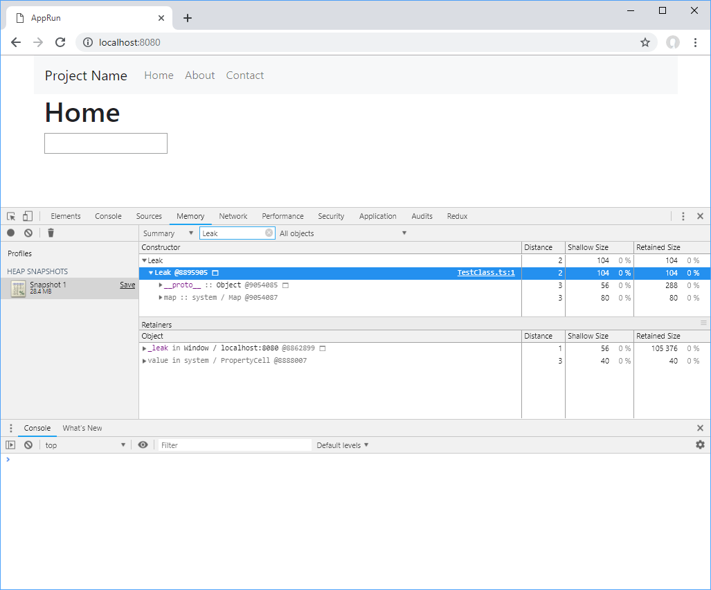
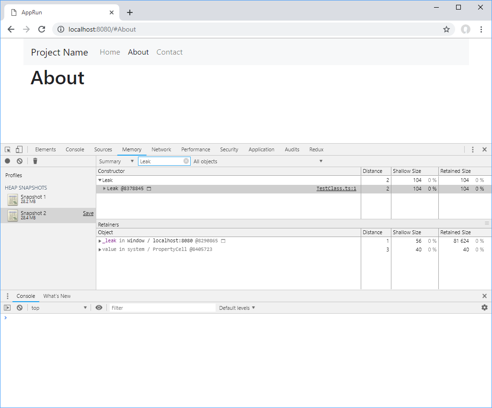
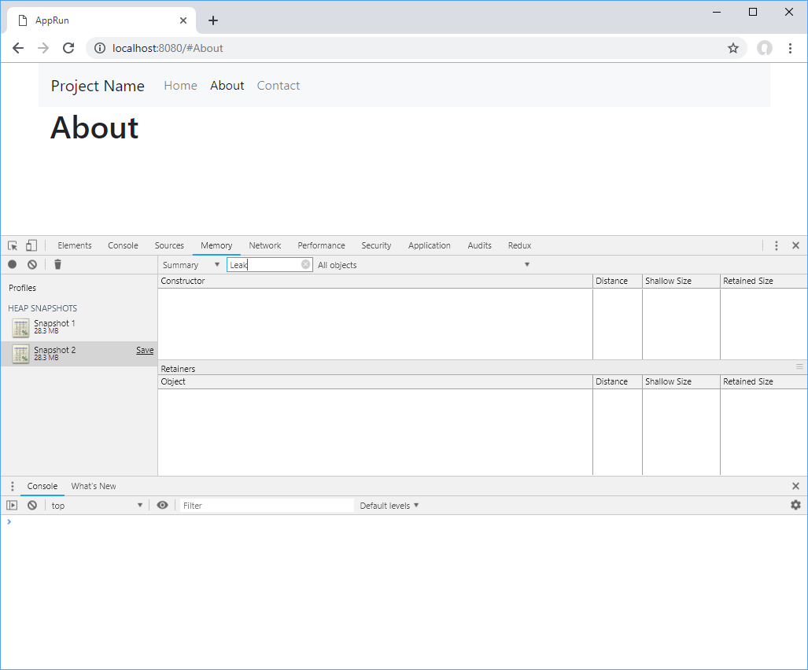

# AppRun Leak Test

## Introduction

When integrating with 3rd party libraries, AppRun component creates the class from the library in the _rendered_ function and attaches the element to it.

```javascript
import app, { Component } from 'apprun';
import Test from './TestClass'

export default class extends Component {
  state = {}
  view = () => <div/>
  update = {}
  rendered = ()=> new Test(document.querySelector('input'))
}
```

Sometimes the 3rd party creates objects in the _window_ object. We can mimic the scenario in the _TestClass, which class creates the _Leak_ class in the _window_ object.

You can see the __leak_ object in the Chrome Developer Tools.



```javascript

class Leak { }
export default class TestClass {
  constructor(el: HTMLInputElement) {
    window['_leak'] = new Leak();
    el.addEventListener('input', _ => {
      console.log(el.value);
    });
  }

  destroy() {
    window['_leak'] = null;
  }
}
```

When switch from the _Home_ page to the _About_ page, the __leak_ object stays in the _window_ object.



If the 3rd party class provides a function to clean up the resource it uses, we can use the _MutationObserver_ to monitor the element and call the clean up function (the _destroy_ function in the _TestClass_).


```javascript
  rendered = () => {
    const input = document.querySelector('input')
    const test = new Test(input);
    const observer = new MutationObserver(changes => {
      changes[0].removedNodes.forEach(node => {
        if (node === input) {
          test.destroy();
          observer.disconnect();
        }
      });
    });
    observer.observe(input.parentNode, { childList: true });
  }
```

By calling the _destroy_ function in the _MutationObserver_, the __leak_ object is removed from the _window_ object.




## Run the Example
* Use _npm start_ to start the dev server
* Use _npm test_ to run unit tests
* Use _npm run build_ to build for production

This is an application built with [AppRun](https://github.com/yysun/apprun).