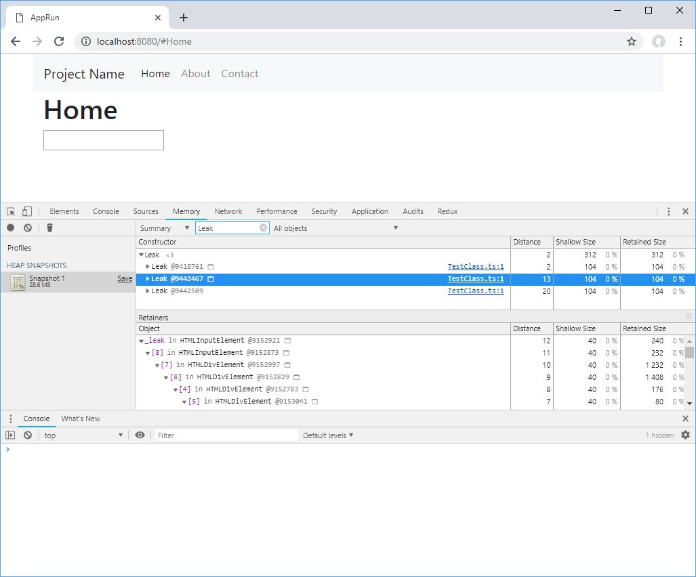
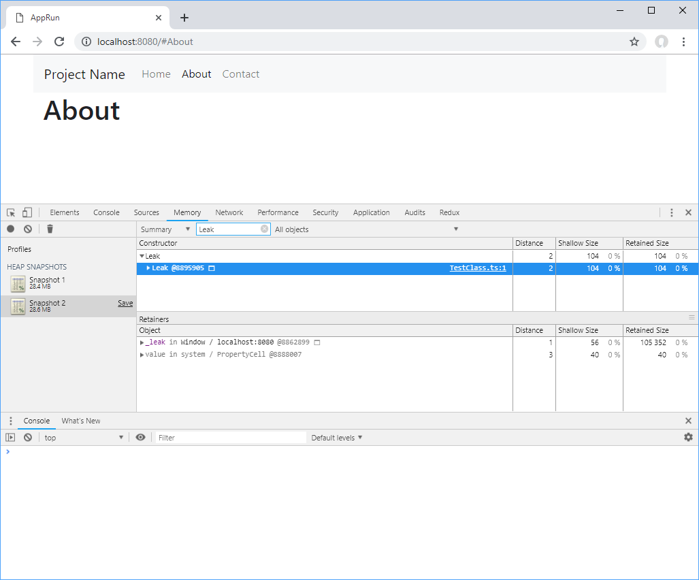

# AppRun Leak Test

## Introduction

When integrating with 3rd party libraries, AppRun components create the 3rd party classes in the AppRun lifecycle function, the _rendered_ function.

```javascript
import app, { Component } from 'apprun';
import Test from './TestClass'

export default class extends Component {
  state = {}
  view = () => <div/>
  update = {}
  rendered = ()=> new Test(document.querySelector('input'))
}
```

Sometimes the 3rd party creates objects in the _window_ object,in  the DOM element or in the class itself. We can mimic the scenarios using the _TestClass below, which creates objects from the _Leak_ class.

```javascript

class Leak { }
export default class TestClass {

  _leak: Leak;

  constructor(el: HTMLInputElement) {
    window['_leak'] = new Leak();
    el['_leak'] = new Leak();
    this._leak = new Leak();
    el.addEventListener('input', _ => {
      console.log(el.value);
    });
  }

  destroy() {
    this._leak = null;
    window['_leak'] = null;
    console.log('TestClass.destroy');
  }
}
```

You can see the __leak_ object in the Chrome Developer Tools on the _Home_ page.





When switch from the _Home_ page to the _About_ page, the __leak_ object stays in the _window_ object.



If the 3rd party class provides a function to clean up the resource like the _destroy _function in the TestClass, we can use the AppRun lifecycle function _unload_ to call the function.


```javascript
export default class extends Component {

  test: Test;

  /* ... ... */

  rendered = () => {
    const input = document.querySelector('input')
    this.test = new Test(input);
  }

  unload = () => {
    this.test.destroy();
    this.test = null;
  }
}
```

Then, the __leak_ objects are cleared.


## Run the Application

* Use _npm start_ to start the dev server
* Use _npm test_ to run unit tests
* Use _npm run build_ to build for production

This is an application built with [AppRun](https://github.com/yysun/apprun).